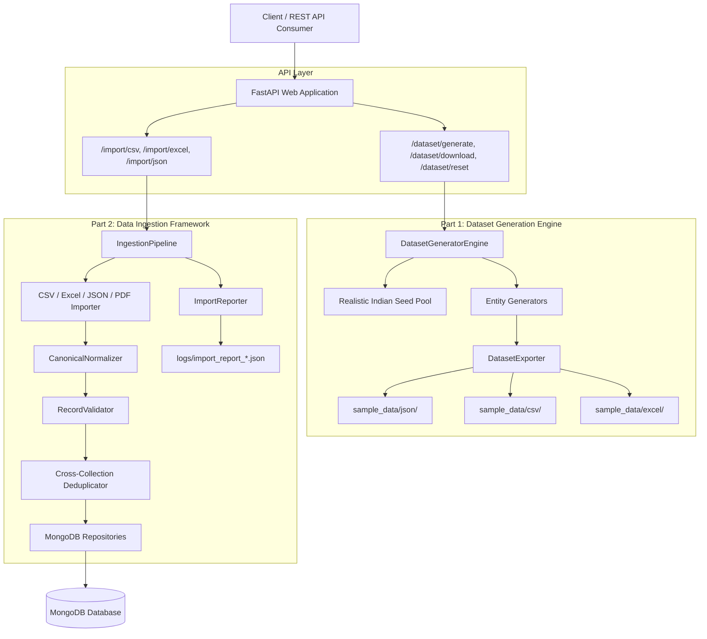
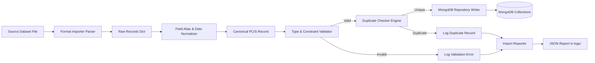
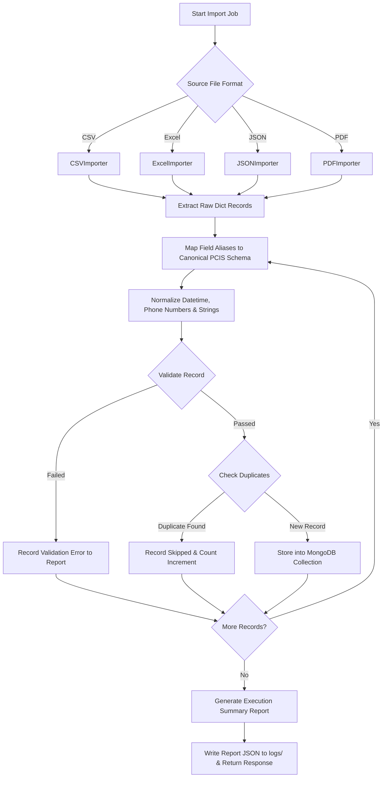
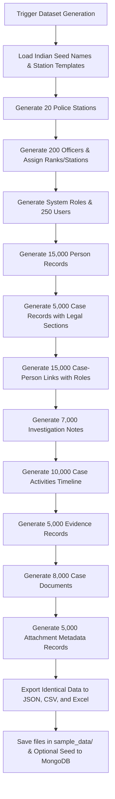
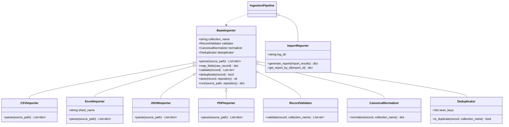
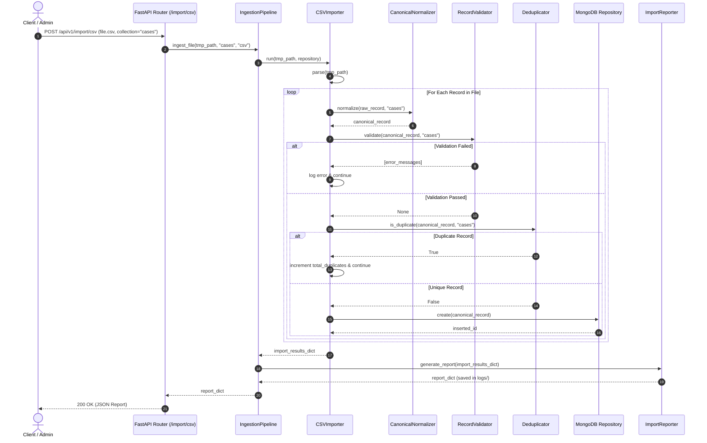

# Police Case Intelligence Platform (PCIS) — Synthetic Dataset Generation & Data Ingestion System

Production-Ready **Synthetic Dataset Generation Engine** and **Modular Data Ingestion Framework** built with Python 3.12, FastAPI, Pydantic, Pandas, OpenPyXL, and MongoDB.

---

## System Architecture

The project follows **Clean Architecture** and **SOLID principles**, separating domain logic, data ingestion pipelines, synthetic dataset engines, database persistence layers, REST API controllers, and the AI Intelligence Layer.

```
pcis/
├── src/
│   ├── config/                      # Application settings, logging, database configuration

│   │   ├── database.py
│   │   ├── logging_config.py
│   │   └── settings.py
│   ├── domain/                      # Pydantic models & domain entities for 11 collections
│   │   ├── entities/                # Station, Officer, Case, Person, Document, Evidence, Note, Activity, Attachment, User, Role
│   │   ├── enums/                   # CrimeCategory, CrimeType, CasePriority, CaseStatus, PersonRole, OfficerRank
│   │   ├── exceptions/              # Custom domain & ingestion exceptions
│   │   └── value_objects/           # Location, Address, GovernmentID
│   ├── infrastructure/              # Database repositories & MongoDB index definitions
│   │   └── database/
│   │       └── mongodb/
│   │           ├── base_repository.py
│   │           ├── indexes.py
│   │           └── repositories.py
│   ├── dataset_generator/           # Part 1: Synthetic Dataset Generation Engine
│   │   ├── engine.py                # Pipeline controller & CLI entry point
│   │   ├── seed_data.py             # Realistic Indian names, stations, legal sections (IPC/BNS), templates
│   │   ├── generators.py            # Entity generators for 11 collections
│   │   └── exporters.py             # Multi-format Exporters (JSON, CSV, Excel .xlsx)
│   ├── ingestion/                   # Part 2: Data Ingestion Framework
│   │   ├── pipeline.py              # Ingestion pipeline orchestrator (Parse -> Validate -> Normalize -> Dedup -> Store)
│   │   ├── importers/               # Source Importers (BaseImporter, CSV, Excel, JSON, PDF)
│   │   ├── validators/              # Schema & Business Rule Validators
│   │   ├── normalizers/             # Field Mapping & Canonical Schema Normalizers
│   │   ├── duplicate_checker/       # Cross-Collection Deduplication Engine
│   │   └── reporter.py              # Import Summary & Log Generator
│   ├── api/                         # FastAPI REST Endpoints & Routes
│   │   ├── app.py
│   │   └── routes/
│   │       ├── ingestion_routes.py  # File import endpoints & report retrieval
│   │       ├── dataset_routes.py    # Synthetic dataset generator endpoints
│   │       ├── case_routes.py
│   │       ├── person_routes.py
│   │       └── resource_routes.py
│   ├── ai/                          # Part 3: AI Intelligence Layer (RAG Pipeline)
│   │   ├── embeddings/              # Embedding generator & CSV chunking
│   │   ├── vectorstore/             # FAISS store
│   │   ├── retrievers/              # Mongo, Vector, and Hybrid retrievers
│   │   ├── workflow/                # LangGraph StateGraph pipeline
│   │   ├── planner/                 # Query intent & filter extraction
│   │   ├── context_builder/         # Context building
│   │   ├── llm/                     # Groq LLM integration
│   │   ├── services/                # RAG Service (cache, orchestration)
│   │   ├── routers/                 # AI API routes (/query, /stream, /chat)
│   │   └── utils/                   # Cache, Audit Logger, Memory, Token Counter
├── sample_data/                     # Generated multi-format synthetic datasets
│   ├── json/                        # JSON collection files & all_collections.json
│   ├── csv/                         # CSV collection files
│   └── excel/                       # Excel collection files & police_master_dataset.xlsx
├── logs/                            # Audit Logs & Import Execution Reports
├── tests/                           # Unit & Integration Pytest Suite
└── README.md
```

---

## Architectural & Process Diagrams

### 1. System Architecture Diagram



---

### 2. Data Flow Diagram



---

### 3. Import Workflow Diagram



---

### 4. Dataset Generation Workflow Diagram



---

### 5. Class Diagram



---

### 6. Sequence Diagram



---

## Setup & Running Guide

### 1. Environment Setup
Create virtual environment and install dependencies:
```bash
python -m venv venv
venv\Scripts\activate
pip install -r requirements.txt
```

### 2. Run Synthetic Dataset Generator Engine CLI
Generate full 5,000 cases synthetic police ecosystem across JSON, CSV, and Excel:
```bash
python -m src.dataset_generator.engine --stations 20 --officers 200 --persons 15000 --cases 5000
```
Exported files will be generated under `sample_data/`:
- `sample_data/json/`
- `sample_data/csv/`
- `sample_data/excel/` (`police_master_dataset.xlsx` & individual collection workbooks)

### 3. Launch FastAPI Application
```bash
python -m src.main
```
Access interactive OpenAPI documentation at: `http://localhost:8000/docs`

### 4. Run Pytest Test Suite
```bash
python -m pytest tests/ -v
```

---

## Core API Endpoints

- `POST /api/v1/import/csv` — Import CSV dataset file into target collection.
- `POST /api/v1/import/excel` — Import Excel dataset file into target collection.
- `POST /api/v1/import/json` — Import JSON dataset file into target collection.
- `GET /api/v1/imports/history` — List history of import execution runs.
- `GET /api/v1/imports/report/{import_id}` — Retrieve detailed validation/duplicate report.
- `POST /api/v1/dataset/generate` — Trigger synthetic dataset generation via REST API.
- `GET /api/v1/dataset/download` — Download generated JSON, CSV, or Excel dataset files.
- `POST /api/v1/dataset/reset` — Reset database collections and clear sample dataset files.

---

## AI Intelligence Layer Endpoints (RAG Pipeline)

For detailed information, see `src/ai/README.md`.
- `POST /api/v1/ai/query` — Unified RAG query using Groq LLM with intent-based prompt routing.
- `POST /api/v1/ai/stream` — Streaming LLM response via SSE (token-by-token).
- `POST /api/v1/ai/chat` — Multi-turn conversational AI with memory (`session_id`).
- `POST /api/v1/ai/similar` — Find top-K semantically similar documents.
- `POST /api/v1/ai/statistics` — Fetch crime statistics context without full LLM generation.
- `POST /api/v1/ai/summarize` — Summarize a case or dataset.
- `POST /api/v1/ai/compare` — Compare two entities or regions.
- `POST /api/v1/ai/index/build` — Trigger background FAISS index build.
- `GET /api/v1/ai/index/status` — Get status of FAISS index build.
- `GET /api/v1/ai/health` — Get health status of AI components.
