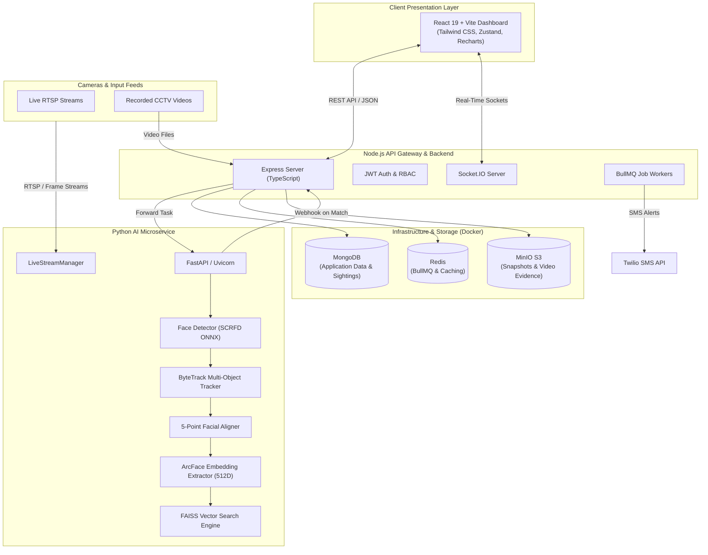

# 🛡️ Sentinel — AI-Powered Facial Recognition & Intelligent Surveillance Management System

[](https://nodejs.org/)
[](https://python.org/)
[](https://fastapi.tiangolo.com/)
[](https://react.dev/)
[](https://www.typescriptlang.org/)
[](https://www.docker.com/)
[](https://github.com/facebookresearch/faiss)
[](#license)

**Sentinel** is an enterprise-grade, real-time facial recognition and intelligent surveillance management platform. Designed with a high-throughput microservices architecture, Sentinel seamlessly connects RTSP camera streams, high-speed neural network computer vision pipelines, vector similarity search, case/suspect management, geospatial tracking, and real-time security alerts into an intuitive operational dashboard.

---

## 📑 Table of Contents

- [Key Features](#-key-features)
- [System Architecture](#-system-architecture)
- [System Design Specification (Full Blueprint)](./SYSTEM_DESIGN_SPECIFICATION.md)
- [AI Pipeline & Computer Vision Deep Dive](#-ai-pipeline--computer-vision-deep-dive)
- [Data Flow & System Workflow](#-data-flow--system-workflow)
- [Tech Stack](#-tech-stack)
- [Project Directory Structure](#-project-directory-structure)
- [Prerequisites](#-prerequisites)
- [Quick Start Guide](#-quick-start-guide)
  - [1. Clone Repository](#1-clone-repository)
  - [2. One-Click Startup (Recommended)](#2-one-click-startup-recommended)
  - [3. Manual / Individual Service Startup](#3-manual--individual-service-startup)
- [Environment Variables](#-environment-variables)
- [API Reference](#-api-reference)
- [Troubleshooting & FAQs](#-troubleshooting--faqs)
- [Contributing & License](#-contributing--license)

---

## 🌟 Key Features

### 👁️ Real-Time Face Detection & Neural Identification
- **SCRFD Neural Face Detection**: Multi-scale feature detection across strides (8, 16, 32) capable of capturing faces at variable distances and angles.
- **5-Point Landmark Face Alignment**: Geometrically normalizes facial pose prior to feature extraction.
- **ArcFace Deep Embeddings (512D)**: State-of-the-art embedding generation using ONNX Runtime with automatic GPU CUDA acceleration fallback.
- **FAISS Vector Search**: Instantaneous sub-millisecond similarity matching against millions of registered suspects using normalized cosine inner-product indexing (`IndexFlatIP`).
- **3-Frame Temporal Voting**: Prevents single-frame false alarms by requiring consecutive matching across video frames.
- **Face Quality Gate**: Dynamic Laplacian variance blur filtering and minimum resolution thresholds.
- **Track-Level Recognition Cache**: RAM-based identity cache linked to ByteTrack IDs to eliminate redundant neural inference on tracked faces.

### 📹 Live RTSP & Video Batch Analytics
- **Continuous RTSP Stream Ingestion**: Resilient connection management with exponential backoff auto-recovery (2s to 60s) and configurable FPS capping.
- **Recorded Video Investigation**: Offline processing of uploaded CCTV footage with keyframe timeline extraction, suspect sighting matching, and unknown face discovery.
- **Unknown Person Cataloging**: Clusters recurring unidentified faces to detect suspicious recurring loiterers.

### 🚨 Suspect Relay Network & Real-Time Alerts
- **Suspect Relay Chase Network**: Tracks suspect trajectory and predicts movement vectors across camera topologies.
- **Geofenced Security Zones**: Configurable physical zones triggering prioritized alert dispatches upon suspect entry.
- **Real-Time WebSockets**: Instant dashboard alerts and notification toasts via Socket.IO.
- **Multi-Channel Dispatch**: Automated SMS alerts via Twilio and automated PDF intelligence report generation.

### 📊 Modern Security Command Center
- **Interactive Geospatial Map**: Live camera placement, suspect sighting timelines, and heatmaps.
- **Case & Complaint Management**: Full investigation lifecycle tracking, evidence binding, and audit logging.
- **AI RAG Knowledge Engine**: Contextual incident intelligence and forensic search assistant.
- **Comprehensive Analytics**: Sighting frequencies, peak activity periods, camera uptime, and detection confidence metrics via Recharts.

---

## 🏗️ System Architecture

Sentinel is organized as a decoupled, event-driven microservices ecosystem:



---

## 🔬 AI Pipeline & Computer Vision Deep Dive

For an exhaustive presentation-ready breakdown, refer to [`AI_PIPELINE_DETAILS.md`](./AI_PIPELINE_DETAILS.md).

```
 ┌────────────────┐     ┌────────────────┐     ┌────────────────┐
 │ Video Frame    │ ──> │ Face Detection │ ──> │   ByteTrack    │
 │ (RTSP / Video) │     │ (SCRFD / ONNX) │     │ (Track ID Pass)│
 └────────────────┘     └────────────────┘     └────────────────┘
                                                       │
 ┌────────────────┐     ┌────────────────┐             ▼
 │ 5-Point Align  │ <── │ Quality Filter │ <── [Check Track Cache]
 │ & ArcFace 512D │     │ (Blur / Size)  │     (Hit: Skip heavy AI)
 └────────────────┘     └────────────────┘
         │
         ▼
 ┌────────────────┐     ┌────────────────┐     ┌────────────────┐
 │ FAISS Match    │ ──> │ 3-Frame Voting │ ──> │ Webhook / Alert│
 │ (Cosine Sim)   │     │ (De-noise)     │     │ & MinIO Upload │
 └────────────────┘     └────────────────┘     └────────────────┘
```

1. **Dynamic Resize & SCRFD Detection**: Input frames are scaled down (max 640px) while maintaining aspect ratios. SCRFD detects bounding boxes and 5 facial keypoints across 3 strides. Non-Maximum Suppression (NMS, IoU 0.4) strips overlapping boxes.
2. **ByteTrack Object Association**: Tracks faces continuously across frames, maintaining a persistent `track_id` even during slight rotations or temporary occlusions.
3. **Identity Cache Bypass**: If a `track_id` has already been confirmed in recent frames, the pipeline skips heavy neural feature extraction, boosting FPS significantly.
4. **Laplacian Blur & Resolution Gate**: Faces below minimum pixel dimensions or with a Laplacian variance below `BLUR_THRESHOLD` are discarded to ensure high matching precision.
5. **Geometric Alignment & 512D Embeddings**: Uses affine transformation on 5 keypoints so eyes and mouth match canonical coordinates, passed through ArcFace for a 512-dimensional unit vector.
6. **FAISS `IndexFlatIP` Similarity Search**: Fast normalized inner product vector comparison against all active registered suspect embeddings.
7. **Temporal Voting & Deduplication**: Requires **3 consecutive matching frames** before triggering an alert. An alert cooldown (default 60s per camera-suspect pair) prevents alert flooding.

---

## 🔄 Data Flow & System Workflow

1. **Camera Stream Acquisition**: The backend registers RTSP camera feeds and coordinates with the Python AI service to launch a `LiveStreamManager` worker.
2. **Vision Processing**: Frames are processed at capped framerates; faces are detected, tracked, aligned, embedded, and queried in FAISS.
3. **Alert Webhook**: When a suspect match satisfies confidence thresholds and passes 3-frame voting, the AI service triggers `POST /api/webhooks/recognition-alert` on the Node.js backend.
4. **Evidence Persistence**: The backend logs the sighting in MongoDB and archives the cropped face snapshot into MinIO S3.
5. **Real-Time Notification**: Socket.IO broadcasts the alert payload to all active client dashboards, while BullMQ enqueues SMS/email notifications.
6. **Relay Chase & Spatial Mapping**: If enabled, the suspect's latest sighting updates the relay tracking network to monitor trajectory and notify neighboring camera zones.

---

## 🛠️ Tech Stack

| Layer | Technologies |
| :--- | :--- |
| **Frontend** | React 19, TypeScript, Vite, Tailwind CSS, Zustand, TanStack Query, React Router DOM, Recharts, Lucide Icons |
| **Backend API** | Node.js, Express.js, TypeScript, Mongoose (MongoDB), Redis (ioredis), BullMQ, Socket.IO, MinIO AWS S3 SDK, Zod, PDFKit, JWT |
| **AI / ML Service** | Python 3.10+, FastAPI, Uvicorn, OpenCV, ONNX Runtime (CPU/GPU), FAISS (Facebook AI Similarity Search), LAPX / ByteTrack, Pydantic, Scikit-Image, PyMongo |
| **Infrastructure** | Docker, Docker Compose, MongoDB 7.x, MinIO S3 Object Storage, Redis Alpine |

---

## 📂 Project Directory Structure

```
Major/
├── docker-compose.yml           # Multi-container setup (MongoDB, MinIO, Redis)
├── package.json                 # Workspace root scripts
├── start_all.py                 # Multi-service launcher with unified streaming logs
├── start.bat                    # Windows one-click startup batch script
├── run.bat                      # Alternative startup batch script
├── AI_PIPELINE_DETAILS.md       # In-depth technical guide to the computer vision pipeline
│
├── frontend/                    # React 19 + Vite Frontend
│   ├── src/
│   │   ├── api/                 # Axios HTTP client instances & endpoints
│   │   ├── components/          # Modular UI components (Navbar, Modals, StreamCards, etc.)
│   │   ├── pages/               # Application views
│   │   │   ├── monitoring/      # Live surveillance & RTSP monitoring
│   │   │   ├── cameras/         # Camera grid & stream setup
│   │   │   ├── suspects/        # Suspect registry & registration
│   │   │   ├── cases/           # Case files & investigation records
│   │   │   ├── complaints/      # Citizen complaint management
│   │   │   ├── map/             # Geospatial sighting map & camera placement
│   │   │   ├── analytics/       # Threat intelligence & detection charts
│   │   │   ├── unknowns/        # Unidentified face discovery & clustering
│   │   │   ├── rag/             # AI RAG investigative assistant
│   │   │   └── settings/        # System configuration
│   │   ├── store/               # Zustand state stores (auth, alerts, sockets)
│   │   ├── types/               # Shared TypeScript types & interfaces
│   │   └── router/              # React Router DOM configuration
│   └── package.json
│
├── backend/                     # Node.js + Express + TypeScript Backend
│   ├── src/
│   │   ├── config/              # MongoDB, Redis, and MinIO connection configs
│   │   ├── controllers/         # Request handlers (Auth, Camera, Suspect, Alert, AI)
│   │   ├── middlewares/         # JWT authentication, Zod validation, error handling
│   │   ├── models/              # Mongoose schemas (User, Camera, Suspect, Alert, Sighting, Zone)
│   │   ├── queues/              # BullMQ queue definitions and workers
│   │   ├── repositories/        # Database query abstractions
│   │   ├── routes/              # Express API endpoint routers
│   │   ├── services/            # Business logic (Recognition, Notification, Storage)
│   │   ├── socket/              # Socket.IO event handlers and emitters
│   │   └── utils/               # AppError, logger, formatters, PDF helpers
│   ├── .env.example             # Backend environment template
│   └── package.json
│
└── ai-service/                  # Python FastAPI AI Microservice
    ├── config/                  # AI service settings & model path definitions
    ├── models/                  # ONNX weights (SCRFD detector, ArcFace recognizer)
    ├── pipelines/               # Vision pipelines
    │   ├── live_pipeline.py     # RTSP stream reader with auto-reconnection
    │   ├── recognition_pipeline.py # Detection, ByteTrack, Alignment, FAISS matching
    │   ├── registration_pipeline.py # Suspect face registration & embedding storage
    │   └── video_pipeline.py    # Offline video file batch processor
    ├── routes/                  # FastAPI endpoints (streams, registration, videos, metrics)
    ├── schemas/                 # Pydantic request/response schemas
    ├── services/                # Core AI services (detector, tracker, recognizer, faiss_manager)
    ├── main.py                  # FastAPI application entry point
    └── requirements.txt         # Python dependencies
```

---

## 📋 Prerequisites

Before running Sentinel, ensure you have the following installed:

- **Node.js**: `v18.0.0` or higher ([Download](https://nodejs.org/))
- **Python**: `3.10.x` or higher ([Download](https://www.python.org/))
- **Docker Desktop**: For MongoDB, Redis, and MinIO ([Download](https://www.docker.com/))
- **Git**: For source control ([Download](https://git-scm.com/))

---

## ⚙️ Quick Start Guide

### 1. Clone Repository

```bash
git clone https://github.com/poorvikkg/FinalMajor.git
cd FinalMajor
```

### 2. One-Click Startup (Recommended)

Sentinel includes an orchestration script (`start_all.py`) that boots Docker containers, Backend, AI Service, and Frontend with color-coded live logs in a single terminal.

```bash
python start_all.py
```

*Or on Windows:*
```cmd
start.bat
```

The system will be accessible at:
- 🌐 **Frontend Dashboard**: [http://localhost:5173](http://localhost:5173)
- 🚀 **Node.js API Backend**: [http://localhost:5000](http://localhost:5000)
- 🧠 **FastAPI AI Service**: [http://localhost:8000](http://localhost:8000) (Docs: [http://localhost:8000/docs](http://localhost:8000/docs))
- 🪣 **MinIO Console**: [http://localhost:9001](http://localhost:9001) (`minioadmin` / `minioadmin`)

---

### 3. Manual / Individual Service Startup

If you prefer to start each service individually:

#### Step 1: Start Docker Infrastructure
```bash
docker-compose up -d
```
*Verifies MongoDB (`27017`), MinIO (`9000/9001`), and Redis (`6379`) are running.*

#### Step 2: Set Up & Run Backend
```bash
cd backend
cp .env.example .env     # Update configuration if needed
npm install
npm run dev
```

#### Step 3: Set Up & Run AI Service
```bash
cd ai-service

# Create virtual environment
python -m venv venv

# Activate virtual environment
# On Windows:
venv\Scripts\activate
# On Linux/macOS:
source venv/bin/activate

# Install requirements
pip install -r requirements.txt

# Start FastAPI server
python -m uvicorn main:app --reload --port 8000
```

#### Step 4: Set Up & Run Frontend
```bash
cd frontend
npm install
npm run dev
```

---

## 🔒 Environment Variables

### Backend (`backend/.env`)

| Variable | Default Value | Description |
| :--- | :--- | :--- |
| `PORT` | `5000` | Port for Express REST API |
| `NODE_ENV` | `development` | Runtime environment (`development` / `production`) |
| `MONGODB_URI` | `mongodb://localhost:27017/surveillance_db` | MongoDB connection URI |
| `JWT_SECRET` | `your_super_secret_jwt_key` | Secret key for signing authentication tokens |
| `JWT_EXPIRES_IN` | `7d` | Token expiration timeframe |
| `UPLOAD_DIR` | `uploads` | Local temporary directory for file processing |
| `MAX_FILE_SIZE` | `500mb` | Maximum file upload size limit |
| `CORS_ORIGIN` | `http://localhost:5173` | Allowed client origin for CORS policy |
| `RATE_LIMIT_WINDOW_MS`| `900000` | Rate limiting window in milliseconds (15 mins) |
| `RATE_LIMIT_MAX` | `100` | Max requests per rate limiting window |
| `MINIO_ENDPOINT` | `http://localhost:9000` | MinIO S3 API endpoint |
| `MINIO_ACCESS_KEY`| `minioadmin` | MinIO root access key |
| `MINIO_SECRET_KEY`| `minioadmin` | MinIO root secret key |
| `MINIO_BUCKET` | `sentinel-bucket` | Default S3 bucket name for evidence files |
| `REDIS_URL` | `redis://localhost:6379` | Redis connection URL for BullMQ queues |

### AI Service (`ai-service/.env`)

| Variable | Default Value | Description |
| :--- | :--- | :--- |
| `PORT` | `8000` | AI microservice port |
| `BACKEND_WEBHOOK_URL` | `http://localhost:5000/api/webhooks/recognition-alert` | Endpoint to notify backend on face match |
| `SIMILARITY_THRESHOLD`| `0.60` | Cosine similarity threshold for facial matching |
| `BLUR_THRESHOLD` | `100.0` | Minimum Laplacian variance score for quality gate |
| `ALERT_COOLDOWN_SEC` | `60` | Minimum seconds between recurring alerts per suspect |
| `VOTE_FRAMES` | `3` | Number of consecutive matching frames required |

---

## 🔌 API Reference

### Backend API (`http://localhost:5000/api`)

| Prefix | Method | Description |
| :--- | :--- | :--- |
| `/auth` | `POST /register`, `POST /login`, `GET /me` | Authentication and user session management |
| `/cameras` | `GET /`, `POST /`, `PUT /:id`, `DELETE /:id` | Camera inventory and RTSP feed configuration |
| `/videos` | `POST /upload`, `GET /:id/status` | Video upload and offline batch analysis |
| `/recognition`| `POST /register-suspect`, `POST /search` | Suspect face registration and 1:N photo lookup |
| `/complaints` | `GET /`, `POST /`, `PATCH /:id/status` | Citizen complaint records |
| `/dashboard` | `GET /stats`, `GET /recent-alerts` | High-level system statistics and live feeds |
| `/sightings` | `GET /`, `GET /by-suspect/:id` | Geospatial sightings and movement timeline |
| `/suspect-alerts`| `GET /`, `PATCH /:id/acknowledge`| Real-time alerts and alarm acknowledgement |
| `/unknown-persons`| `GET /`, `POST /merge` | Recurring unidentified face clusters |
| `/zones` | `GET /`, `POST /`, `DELETE /:id` | Geofenced perimeter setup |
| `/ai` | `POST /query-assistant` | AI RAG knowledge search assistant |
| `/webhooks` | `POST /recognition-alert` | Internal webhook consumed by AI microservice |

### AI Microservice API (`http://localhost:8000`)

| Endpoint | Method | Description |
| :--- | :--- | :--- |
| `/docs` | `GET` | Interactive Swagger API documentation |
| `/register` | `POST` | Process photo, extract 512D embedding, and register in FAISS |
| `/streams/start` | `POST` | Connect to live RTSP feed and launch background pipeline |
| `/streams/stop` | `POST` | Terminate live camera processing worker |
| `/videos/process`| `POST` | Execute offline batch recognition on uploaded video |
| `/metrics` | `GET` | Return inference latency, FPS, and GPU/CPU utilization |

---

## ❓ Troubleshooting & FAQs

<details>
<summary><b>1. Docker containers fail to start or port collisions occur</b></summary>

- Check if local instances of MongoDB (`27017`), Redis (`6379`), or MinIO (`9000/9001`) are already running on your machine.
- Free up conflicting ports or modify port mappings in `docker-compose.yml`.
- Verify Docker Desktop is open and running.
</details>

<details>
<summary><b>2. AI Service: ONNXRuntime fails to use GPU</b></summary>

- `onnxruntime-gpu` automatically falls back to CPU execution if NVIDIA CUDA and cuDNN drivers are not installed.
- For CPU-only environments, no manual changes are necessary; FAISS and ONNX inference are optimized for CPU vector instructions.
</details>

<details>
<summary><b>3. RTSP stream fails to connect or keeps reconnecting</b></summary>

- Verify the RTSP stream URL is reachable using VLC Player (`Media -> Open Network Stream`).
- Ensure firewall rules allow inbound/outbound RTSP (typically port `554`) traffic.
- Check AI Service terminal logs for exponential backoff connection status messages.
</details>

<details>
<summary><b>4. MinIO bucket errors on file upload</b></summary>

- Access the MinIO web dashboard at [http://localhost:9001](http://localhost:9001) with `minioadmin` / `minioadmin`.
- Ensure the bucket named `sentinel-bucket` exists, or let the backend initialization script auto-create it.
</details>

---

## 📄 Contributing & License

Contributions, feature requests, and bug reports are welcome! Please open an issue or submit a pull request.

Distributed under the **MIT License**. See `LICENSE` for more information.

---

<p align="center">
  <b>Built with ❤️ for advanced security and surveillance intelligence.</b>
</p>