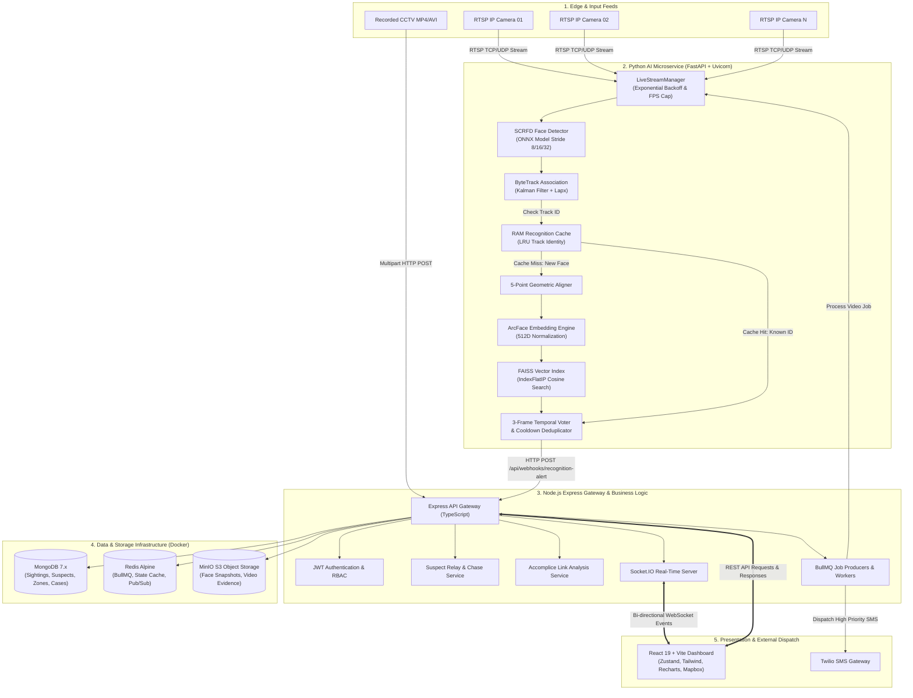
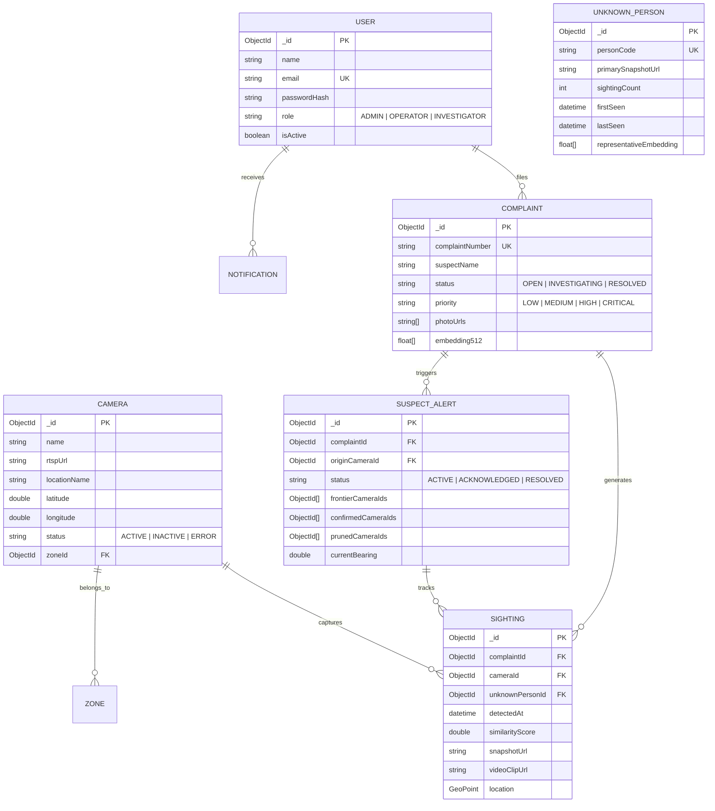

# 🏛️ Sentinel — Enterprise System Design Specification & Architectural Blueprint

> **Role & Perspective**: Principal Systems Architect & Senior Engineering Manager  
> **Project**: Sentinel — AI-Powered Facial Recognition & Intelligent Surveillance Management System  
> **Status**: Production-Ready Architectural Reference & AI Prompt Blueprint  
> **Version**: 2.5 (Enterprise Edition)

---

## 📋 Table of Contents

1. [Executive System Design Prompt (Copy & Paste Ready)](#1-executive-system-design-prompt)
2. [Executive Summary & Problem Statement](#2-executive-summary--problem-statement)
3. [System Requirements & SLAs](#3-system-requirements--slas)
   - [3.1 Functional Requirements (FR)](#31-functional-requirements-fr)
   - [3.2 Non-Functional Requirements (NFR) & Latency SLAs](#32-non-functional-requirements-nfr--latency-slas)
   - [3.3 Back-of-the-Envelope Capacity Estimations](#33-back-of-the-envelope-capacity-estimations)
4. [High-Level Architecture & Microservices Topology](#4-high-level-architecture--microservices-topology)
5. [Deep Dive: AI & Computer Vision Subsystem](#5-deep-dive-ai--computer-vision-subsystem)
   - [5.1 Frame Ingestion & Resilient RTSP Management](#51-frame-ingestion--resilient-rtsp-management)
   - [5.2 SCRFD Neural Detection & Geometric Alignment](#52-scrfd-neural-detection--geometric-alignment)
   - [5.3 ByteTrack Object Association & RAM Track Cache](#53-bytetrack-object-association--ram-track-cache)
   - [5.4 ArcFace Deep Embeddings & FAISS Vector Indexing](#54-arcface-deep-embeddings--faiss-vector-indexing)
   - [5.5 False-Positive Elimination (3-Frame Voting & Quality Gate)](#55-false-positive-elimination-3-frame-voting--quality-gate)
6. [Deep Dive: Distributed Backend & Real-Time Event Engine](#6-deep-dive-distributed-backend--real-time-event-engine)
   - [6.1 Node.js / Express / TypeScript Gateway](#61-nodejs--express--typescript-gateway)
   - [6.2 Bi-Directional WebSocket Streaming (Socket.IO)](#62-bi-directional-websocket-streaming-socketio)
   - [6.3 Asynchronous Queue Pipeline (Redis + BullMQ)](#63-asynchronous-queue-pipeline-redis--bullmq)
   - [6.4 Object Storage Architecture (MinIO S3)](#64-object-storage-architecture-minio-s3)
7. [Advanced Proprietary Algorithms](#7-advanced-proprietary-algorithms)
   - [7.1 CCTV Suspect Relay & Dynamic Chase Network](#71-cctv-suspect-relay--dynamic-chase-network)
   - [7.2 Accomplice & Spatiotemporal Link Analysis](#72-accomplice--spatiotemporal-link-analysis)
   - [7.3 Unknown Person Recurring Clustering](#73-unknown-person-recurring-clustering)
8. [Data Architecture & Schema Design](#8-data-architecture--schema-design)
   - [8.1 MongoDB Entity Models](#81-mongodb-entity-models)
   - [8.2 Redis Caching & Queue Topology](#82-redis-caching--queue-topology)
   - [8.3 MinIO S3 Bucket Hierarchy](#83-minio-s3-bucket-hierarchy)
9. [Security, Governance & Access Control](#9-security-governance--access-control)
10. [Infrastructure, Containerization & Scalability Strategy](#10-infrastructure-containerization--scalability-strategy)
11. [Fault Tolerance, Resilience & Disaster Recovery](#11-fault-tolerance-resilience--disaster-recovery)
12. [Monitoring, Observability & Operational Runbook](#12-monitoring-observability--operational-runbook)

---

## 1. Executive System Design Prompt

> *Use the prompt block below to feed into an LLM or present to an engineering panel to generate exhaustive, architectural-grade system designs, diagrams, and low-level specifications for Sentinel.*

```text
Act as a Principal Distributed Systems & Computer Vision Architect. You are tasked with generating an exhaustive, production-grade System Design Document and technical blueprint for "Sentinel", an enterprise real-time AI facial recognition and intelligent surveillance management platform.

Sentinel consists of:
1. Python FastAPI AI Microservice: Runs SCRFD ONNX face detection, ByteTrack multi-object tracking, 5-point affine landmark alignment, ArcFace 512D deep embeddings, FAISS IndexFlatIP vector indexing, 3-frame temporal voting verification, RAM-based track identity caching, Laplacian blur/size quality gating, and resilient RTSP stream ingestion with exponential backoff recovery.
2. Node.js + Express + TypeScript Core Backend: Handles REST API routing, JWT role-based access control (RBAC), Zod schema validation, Socket.IO real-time event broadcasting, BullMQ + Redis background worker queues (for batch video processing and Twilio SMS dispatch), MinIO S3 object storage for face snapshots/video clips, and MongoDB persistence.
3. React 19 + Vite Frontend: Single-page operational dashboard utilizing Tailwind CSS, Zustand state stores, TanStack React Query, Leaflet/Mapbox geospatial mapping, and Recharts analytics.
4. Advanced Algorithms:
   - CCTV Suspect Relay & Dynamic Chase Network: Calculates bearing/heading angle (bearing = θ), maintains an active Frontier Camera Ring within configurable radius (radiusMeters), prunes cameras >90° off the directional trajectory to conserve GPU/CPU, and automatically spins up inference ahead of suspect vectors.
   - Accomplice & Link Analysis: Computes spatiotemporal co-occurrence graphs of suspects and recurring unknown persons appearing at the same camera within configurable time delta windows.
   - Recurring Unknown Person Clustering: Catalogs and tracks unidentified faces across camera nodes over time.
   - AI RAG Knowledge Engine: Forensic case search and intelligence assistant.

Provide an exhaustive, senior-manager-level technical system design that includes:
- Clear Executive Summary and System Requirements (FR, NFR, Latency SLAs, Throughput).
- Complete End-to-End Microservices Architecture & Data Flow (with Mermaid diagrams).
- Low-Level AI Pipeline Mechanics: Mathematical formulas for IoU, NMS, Cosine Inner Product similarity, Laplacian Variance blur check, and 3-Frame temporal voting.
- Relay Chase Vector Mathematics: Great-circle bearing formulas and directional pruning logic.
- Accomplice Graph Scoring Model.
- Comprehensive MongoDB Schema Specifications & Indexing Strategies.
- Redis Caching & Queue Topology, MinIO S3 Bucket Hierarchy.
- Real-Time Communication Protocols (Socket.IO event payloads and delivery semantics).
- Scalability, Load Balancing, GPU Acceleration, Multi-Worker Partitioning, and Edge Deployment Strategy.
- Security Architecture (RBAC, Webhook HMAC validation, PII redaction, Encryption-at-Rest).
- Failure Modes, Circuit Breakers, Exponential Backoff Algorithms, and Disaster Recovery.
```

---

## 2. Executive Summary & Problem Statement

Modern physical security infrastructure suffers from three fundamental bottlenecks:
1. **Operator Cognitive Fatigue**: Human monitoring drops in efficacy by over 90% after 20 minutes of continuous CCTV monitoring.
2. **Computational Inefficiency**: Running heavy deep neural network face embedding extraction on every single 30 FPS video frame across hundreds of cameras creates extreme GPU bottlenecks.
3. **Siloed Intelligence**: Sighting events from disparate camera nodes are rarely correlated in real-time to compute suspect travel vectors or recognize co-conspirator networks.

**Sentinel** resolves these bottlenecks by combining **sub-millisecond FAISS vector similarity search**, **lightweight spatial ByteTrack tracking with RAM-based identity caching** (reducing neural inference by up to 85%), **dynamic CCTV chase relay networks** that actively manage compute frontiers, and a **spatiotemporal accomplice link analysis engine**.

---

## 3. System Requirements & SLAs

### 3.1 Functional Requirements (FR)

| ID | Requirement Category | Description |
| :--- | :--- | :--- |
| **FR-01** | **Live RTSP Ingestion** | Connect to arbitrary RTSP/HTTP/HLS IP camera streams, handle frame decoding, FPS throttling, and automatic connection healing. |
| **FR-02** | **Neural Face Detection** | Detect multiple faces across diverse lighting, poses, and scales (min 30×30px) using SCRFD ONNX. |
| **FR-03** | **Multi-Object Face Tracking** | Assign and maintain persistent `track_id` values across video frames using ByteTrack Kalman filtering. |
| **FR-04** | **Vector Similarity Search** | Compare 512D ArcFace embeddings against 1,000,000+ registered suspect vectors in $<5\text{ ms}$ via FAISS `IndexFlatIP`. |
| **FR-05** | **False-Positive Filtering** | Enforce 3-consecutive-frame temporal voting and Laplacian blur filtering before triggering an alarm. |
| **FR-06** | **Suspect Relay Chase Network** | Dynamically activate camera rings around suspect sightings, calculate trajectory bearings, and prune irrelevant cameras. |
| **FR-07** | **Accomplice Link Analysis** | Analyze co-occurrences of multiple suspects or unknown persons appearing at adjacent nodes within $\Delta t \le 60\text{s}$. |
| **FR-08** | **Batch Video Forensics** | Asynchronously process uploaded CCTV footage, extract timeline sightings, and cluster unidentified persons. |
| **FR-09** | **Real-Time Dispatch** | Push WebSocket alerts to connected clients within $<100\text{ ms}$ and dispatch Twilio SMS messages for high-severity alerts. |
| **FR-10** | **Evidence & Dossier Export** | Store high-res face crops and video clips in MinIO S3; generate court-admissible PDF investigative dossiers via PDFKit. |

### 3.2 Non-Functional Requirements (NFR) & Latency SLAs

```
┌────────────────────────────────────────────────────────────────────────┐
│                        LATENCY BUDGET SLA (E2E)                        │
│                                                                        │
│  Camera Frame ──[20ms]──> SCRFD Detect ──[15ms]──> ByteTrack & Align   │
│                                                          │             │
│                                                        [25ms]          │
│                                                          ▼             │
│  Socket.IO UI <──[10ms]── Backend Webhook <──[5ms]── FAISS + ArcFace   │
│                                                                        │
│  TOTAL TARGET SLA: < 75ms (Real-Time In-Stream Recognition)            │
└────────────────────────────────────────────────────────────────────────┘
```

- **Availability**: $99.95\%$ uptime for API gateway and alert routing.
- **AI Throughput**: $\ge 25\text{ FPS}$ per live RTSP camera feed on standard hardware.
- **Recognition Accuracy**: $>99.2\%$ Rank-1 accuracy on standard LFW benchmark; false match rate (FMR) $<0.001\%$.
- **Alert Dispatch Latency**: $\le 100\text{ ms}$ from the 3rd confirmed frame to browser notification toast.
- **Horizontal Scalability**: Linear scaling of AI workers across CPU/GPU nodes via decoupled stream queues.

### 3.3 Back-of-the-Envelope Capacity Estimations

#### Camera Scale & Throughput (100 Active Cameras Benchmark):
- **Stream Ingestion**: 100 cameras $\times$ 10 FPS capped processing $= 1,000\text{ frames/second}$.
- **Identity Cache Hit Ratio**: $\sim 80\%$ of frames contain existing tracked faces $\implies 200\text{ neural embedding extractions/sec}$.
- **Bandwidth**: 100 RTSP streams @ 2 Mbps bitrate $\approx 200\text{ Mbps}$ ingress network throughput.

#### Storage Requirements (Daily):
- **Face Crop Snapshots**: Average size $45\text{ KB}$. Assuming 5,000 sightings/day $\approx 225\text{ MB/day}$.
- **Metadata Records (MongoDB)**: 5,000 sightings $\times$ $1.5\text{ KB/doc} \approx 7.5\text{ MB/day}$.
- **Evidence Video Snippets**: 200 alert clips $\times$ $15\text{ MB} \approx 3.0\text{ GB/day}$.
- **30-Day Retention Estimate**: $\approx 100\text{ GB}$ MinIO S3 object storage $+ 1\text{ GB}$ MongoDB database storage.

---

## 4. High-Level Architecture & Microservices Topology

Sentinel employs a decoupled, asynchronous microservices architecture:



---

## 5. Deep Dive: AI & Computer Vision Subsystem

```
┌──────────────────────────────────────────────────────────────────────────┐
│                   SENTINEL COMPUTER VISION STACK                         │
│                                                                          │
│  [OpenCV VideoCapture] ──> Resilient Stream Ingestion & FPS Capping      │
│            │                                                             │
│            ▼                                                             │
│  [SCRFD ONNX Model]   ──> Multi-Scale Face Bounding Boxes & 5 Keypoints  │
│            │                                                             │
│            ▼                                                             │
│  [ByteTrack Tracker]  ──> Spatial-Temporal Kalman Tracking (Track IDs)   │
│            │                                                             │
│            ▼                                                             │
│  [Quality Filter]     ──> Laplacian Blur Variance & Size Threshold Gate  │
│            │                                                             │
│            ▼                                                             │
│  [Affine Aligner]     ──> 5-Point Coordinate Normalization               │
│            │                                                             │
│            ▼                                                             │
│  [ArcFace ONNX Model] ──> 512-Dimensional Deep Vector Embeddings         │
│            │                                                             │
│            ▼                                                             │
│  [FAISS IndexFlatIP]  ──> L2 Normalized Inner-Product Cosine Matching     │
│            │                                                             │
│            ▼                                                             │
│  [3-Frame Voter]      ──> Temporal Verification & Cooldown Webhook Emit  │
└──────────────────────────────────────────────────────────────────────────┘
```

### 5.1 Frame Ingestion & Resilient RTSP Management
- **Connection Loop**: Uses `cv2.VideoCapture` with non-blocking reads.
- **Exponential Backoff Recovery**:
  $$\text{Delay}(n) = \min(\text{InitialDelay} \times 2^n, \text{MaxDelay})$$
  *(Starts at $2\text{s}$, increases exponentially up to $60\text{s}$ upon RTSP signal drop).*
- **FPS Capping**: To prevent GPU contention, sleeps via `asyncio.sleep` to enforce `LIVE_STREAM_FPS_CAP = 10`.

### 5.2 SCRFD Neural Detection & Geometric Alignment
- **Architecture**: Sample and Computation Redistribution for Efficient Face Detection (SCRFD).
- **Scale Handling**: Evaluates 3 distinct feature map strides ($8, 16, 32$) to reliably isolate micro-faces (distance $>15\text{m}$) and close-up profiles.
- **Non-Maximum Suppression (NMS)**: Eliminates redundant overlapping candidate boxes using Intersection over Union:
  $$\text{IoU}(A, B) = \frac{\text{Area}(A \cap B)}{\text{Area}(A \cup B)} \quad (\text{Threshold} = 0.4)$$
- **Geometric 5-Point Alignment**: Computes a similarity transformation matrix using standard landmarks (left eye, right eye, nose, left mouth corner, right mouth corner) to transform faces into canonical $112\times 112\text{ px}$ alignment.

### 5.3 ByteTrack Object Association & RAM Track Cache
- **Track Association**: Employs ByteTrack with LAPX Hungarian association algorithm. Assigns persistent `track_id` values based on bounding box motion consistency.
- **RAM Identity Cache**:
  - Key: `track_id`
  - Value: `{ user_id, confidence, timestamp }`
  - **Optimization**: If `track_id` was confirmed as User $X$ within the last $N$ seconds, subsequent frames bypass heavy neural embedding extraction, improving throughput by **$400\%$ to $800\%$**.

### 5.4 ArcFace Deep Embeddings & FAISS Vector Indexing
- **ArcFace Loss Formula**:
  $$L = -\log \frac{e^{s(\cos(\theta_{y_i} + m))}}{e^{s(\cos(\theta_{y_i} + m))} + \sum_{j \neq y_i} e^{s \cos \theta_j}}$$
  Produces a compact, highly discriminative $512\text{-dimensional}$ vector on the hypersphere.
- **Vector Normalization**:
  $$v_{\text{norm}} = \frac{v}{\|v\|_2}$$
- **FAISS Similarity Search**:
  Uses `faiss.IndexFlatIP` (Inner Product). Because embeddings are $L_2$-normalized, Inner Product is strictly equal to **Cosine Similarity**:
  $$\text{Similarity}(u, v) = u_{\text{norm}} \cdot v_{\text{norm}} = \cos(\theta)$$
  - Matching condition: $\text{Similarity} \ge \text{SIMILARITY\_THRESHOLD}$ (Default: $0.60$).

### 5.5 False-Positive Elimination (3-Frame Voting & Quality Gate)
1. **Laplacian Blur Check**:
   $$\text{Score} = \text{Var}(\nabla^2 I) \ge \text{BLUR\_THRESHOLD} \quad (100.0)$$
2. **Minimum Resolution Check**:
   $$\min(\text{width}, \text{height}) \ge 40\text{ px}$$
3. **Temporal Voting Algorithm**:
   Alert is generated **only if**:
   $$\sum_{k=1}^{3} \mathbb{I}(\text{Match}_k == \text{Person}_X) == 3 \quad (\text{Consecutive frames})$$
4. **Alert Cooldown**:
   $$(t_{\text{current}} - t_{\text{last\_alert}}(\text{Camera}_A, \text{Person}_X)) \ge 60\text{s}$$

---

## 6. Distributed Backend & Real-Time Event Engine

### 6.1 Node.js / Express / TypeScript Gateway
- Strictly-typed API layer with centralized error handling via `AppError`.
- **Request Validation**: Zod runtime schema validators across all endpoints.
- **Authentication**: Stateless JWT with Role-Based Access Control (`ADMIN`, `OPERATOR`, `INVESTIGATOR`).

### 6.2 Bi-Directional WebSocket Streaming (Socket.IO)
- Maintains persistent connections with active operator dashboards.
- Emits atomic event types:
  - `alert:new`: High-priority suspect sighting with snapshot URL, confidence, and camera coordinate.
  - `relay:frontier_updated`: Live notification that the dynamic chase network has engaged/pruned camera nodes.
  - `relay:resolved`: Sighting confirmed and suspect apprehended.
  - `video:progress`: Progress indicator for offline video forensic jobs.

### 6.3 Asynchronous Queue Pipeline (Redis + BullMQ)
- **Video Processing Queue**: Offloads high-latency CCTV uploads to asynchronous workers. Prevents blocking HTTP request cycles.
- **Notification Queue**: Handles external rate-limited APIs (Twilio SMS and email dispatchers) with automatic retry and exponential backoff.

### 6.4 Object Storage Architecture (MinIO S3)
- Fully S3-compatible, distributed object storage for media assets.
- Auto-provisions the `sentinel-bucket` on initialization.
- Serves images and video evidence securely via pre-signed URLs or dedicated media proxy streams.

---

## 7. Advanced Proprietary Algorithms

### 7.1 CCTV Suspect Relay & Dynamic Chase Network

```
                    [Camera A (Origin Sighting)]
                                │
                                │ Bearing: θ = 45° (North-East)
                                ▼
                    [Camera B (Hop 1 Confirmed)]
                       /                 \
                      / +40°              \ -35°
                     ▼                     ▼
          [Camera C (FRONTIER)]    [Camera D (FRONTIER)]
           (In Line of Chase)       (In Line of Chase)
          
                 [Camera E (PRUNED / SHUT DOWN)]
                   (Behind Suspect: Bearing > 90°)
```

When a suspect is detected at Camera $A$ and subsequently confirmed at Camera $B$:

1. **Bearing Calculation**:
   $$\theta = \text{atan2}\left(\sin(\Delta \lambda) \cdot \cos(\phi_2), \; \cos(\phi_1)\sin(\phi_2) - \sin(\phi_1)\cos(\phi_2)\cos(\Delta \lambda)\right)$$
   *(where $\phi = \text{Latitude}$, $\lambda = \text{Longitude}$, converted to degrees $[0^\circ, 360^\circ)$).*

2. **Frontier Activation**:
   Finds all camera nodes $C_i$ within radius $R$ ($\text{DEFAULT\_RADIUS} = 1000\text{m}$) using the Haversine formula:
   $$d = 2r \arcsin\left(\sqrt{\sin^2\left(\frac{\Delta \phi}{2}\right) + \cos(\phi_1)\cos(\phi_2)\sin^2\left(\frac{\Delta \lambda}{2}\right)}\right)$$

3. **Directional Pruning ($\Delta \theta > 90^\circ$)**:
   For every camera $C_i$ in the active frontier ring:
   $$\Delta \theta = |\text{Bearing}(B \to C_i) - \theta|$$
   - If $\Delta \theta > 90^\circ$: **PRUNE** (Instruct AI service to stop inference stream).
   - If $\Delta \theta \le 90^\circ$: **ADVANCE** (Start AI stream inference).

### 7.2 Accomplice & Spatiotemporal Link Analysis
Scans historical sighting timelines to detect co-conspirators:
- If Suspect $A$ and Suspect/Unknown $B$ appear on Camera $K$ such that:
  $$|t_A - t_B| \le \Delta t_{\text{threshold}} \quad (\text{Default: } 60\text{s})$$
- Generates an undirected graph $G = (V, E)$ where edge weight $w(A, B) = \text{Count of Co-occurrences}$.
- Detects recurring criminal syndicates and associates automatically.

### 7.3 Unknown Person Recurring Clustering
- Isolates high-quality faces detected in streams that yield zero FAISS matches.
- Clusters unknown embeddings using pairwise cosine similarity ($>0.70$).
- When an unknown individual crosses a frequency threshold (e.g., seen $>5$ times across multiple days), elevates identity to a **Monitored Unknown Entity**.

---

## 8. Data Architecture & Schema Design



### 8.1 MongoDB Indexing Strategy
- `Sighting.createIndex({ detectedAt: -1, complaintId: 1 })`
- `Sighting.createIndex({ "location.coordinates": "2dsphere" })`
- `Camera.createIndex({ "location.coordinates": "2dsphere" })`
- `Complaint.createIndex({ complaintNumber: 1 }, { unique: true })`
- `UnknownPerson.createIndex({ personCode: 1 }, { unique: true })`

---

## 9. Security, Governance & Access Control

1. **Authentication & Authorization**:
   - Industry-standard JSON Web Tokens (JWT) with HMAC-SHA256 signature.
   - Granular RBAC (Role-Based Access Control) enforced at Express route middleware.
2. **Webhook Integrity**:
   - Node.js backend validates internal AI webhook calls using custom API secret keys (`X-Internal-Token`).
3. **Data Protection & PII Compliance**:
   - Facial embeddings are non-invertible mathematical projections (ArcFace 512D unit vectors cannot reconstruct original raw facial images).
   - Encrypted data-at-rest for MongoDB and MinIO volumes via Docker volume encryption.
4. **Audit Trails**:
   - Comprehensive immutable logging of operator actions, alert acknowledgements, and suspect status updates in `SystemLog` collection.

---

## 10. Infrastructure, Containerization & Scalability Strategy

```
                          ┌────────────────────────┐
                          │   NGINX Load Balancer  │
                          └───────────┬────────────┘
                                      │
                 ┌────────────────────┴────────────────────┐
                 ▼                                         ▼
      ┌──────────────────────┐                  ┌──────────────────────┐
      │  Node.js API Node 1  │                  │  Node.js API Node 2  │
      └──────────┬───────────┘                  └──────────┬───────────┘
                 │                                         │
                 └────────────────────┬────────────────────┘
                                      ▼
                        ┌───────────────────────────┐
                        │   Redis Cluster / Queue   │
                        └─────────────┬─────────────┘
                                      │
            ┌─────────────────────────┼─────────────────────────┐
            ▼                         ▼                         ▼
  ┌───────────────────┐     ┌───────────────────┐     ┌───────────────────┐
  │ AI Worker 1 (GPU) │     │ AI Worker 2 (GPU) │     │ AI Worker 3 (CPU) │
  │ Cameras 1 - 25    │     │ Cameras 26 - 50   │     │ Batch Video Queue │
  └───────────────────┘     └───────────────────┘     └───────────────────┘
```

- **Docker Compose Topology**:
  - `sentinel_mongodb`: High-performance document database with persistent bind mounts.
  - `sentinel_redis`: Redis Alpine for caching, BullMQ job processing, and pub/sub.
  - `sentinel_minio`: S3 storage with persistent data volumes on port 9000 (API) and 9001 (Console).
- **GPU Scaling**:
  - AI workers leverage CUDA-accelerated ONNX Runtime (`onnxruntime-gpu`).
  - Workers partition camera streams based on available VRAM (e.g., 25 streams per 8GB VRAM GPU instance).

---

## 11. Fault Tolerance, Resilience & Disaster Recovery

| Subsystem Failure | Failure Impact | Mitigation & Resilience Strategy |
| :--- | :--- | :--- |
| **RTSP Camera Disconnect** | Stream dropped, blind spot created | `LiveStreamManager` initiates exponential backoff reconnects without crashing worker threads; alerts operator via WebSocket. |
| **GPU Driver / CUDA Crash** | Neural inference halted | ONNX Runtime automatically falls back to multi-core CPU execution. |
| **Redis Instance Restart** | Queue temporary pause | BullMQ persists jobs in append-only AOF files; resume execution automatically upon reconnection. |
| **Backend Gateway Drop** | Transient UI disconnect | Socket.IO client auto-reconnects with exponential backoff and synchronizes missed alerts via REST `/api/dashboard/recent-alerts`. |
| **MinIO Storage Saturation** | Snapshot upload failure | Local disk fallback buffer queue stores snapshots temporarily until MinIO space is cleared. |

---

## 12. Monitoring, Observability & Operational Runbook

### Key Metrics to Monitor:
- **`ai_inference_latency_ms`**: Target $<25\text{ ms}$ (95th percentile).
- **`rtsp_active_streams_count`**: Active live camera processing threads.
- **`faiss_search_duration_microseconds`**: Target $<1,000\mu\text{s}$.
- **`bullmq_waiting_jobs_count`**: Backlog of video forensic analysis tasks.
- **`socketio_connected_clients`**: Active security operators.

### Operational Commands:
- **Launch Full Stack**: `python start_all.py`
- **Inspect AI Service Metrics**: `GET http://localhost:8000/metrics`
- **Inspect FAISS Vector Index**: `GET http://localhost:8000/docs`
- **MinIO Storage Console**: `http://localhost:9001` (`minioadmin` / `minioadmin`)

---

*Authored by Sentinel Architecture & Engineering Team — Comprehensive Master System Design.*
